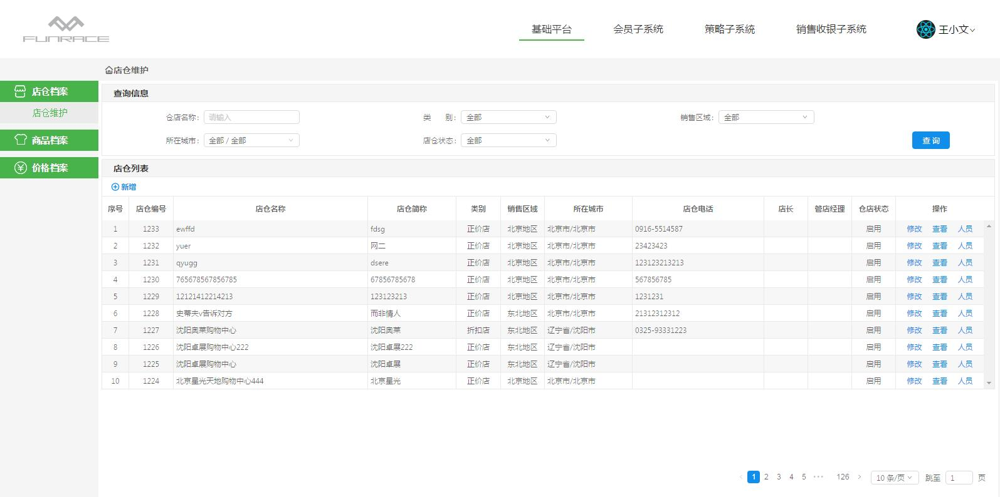
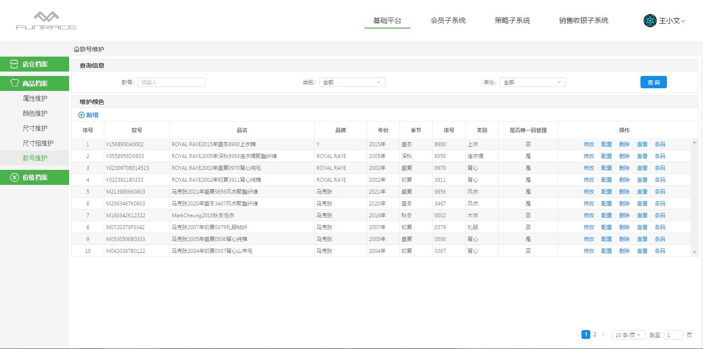
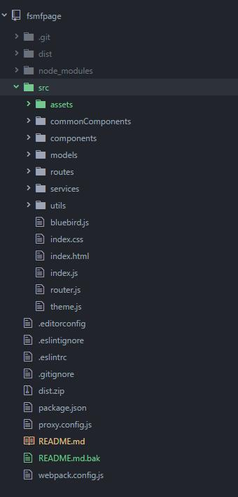

#使用ant design搭建的后台管理系统
* 本后台管理系统是基于[AntDesign2.7.2](https://ant.design/)开发的后端页面例子，
* 整合react，react-router,react-redux，react-router-redux。进行页面状态控制
* 实用fetch进行页面请求，最终生成静态页面，实现前后端完全分离

## 截屏
web

##使用了dva应用框架，整个目录结构如下图

